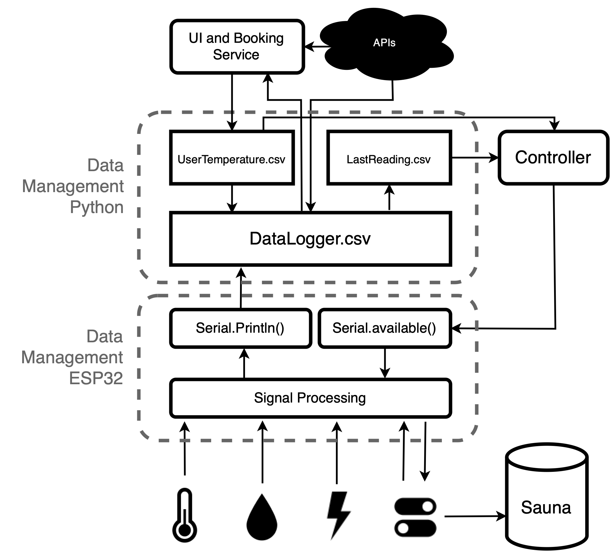
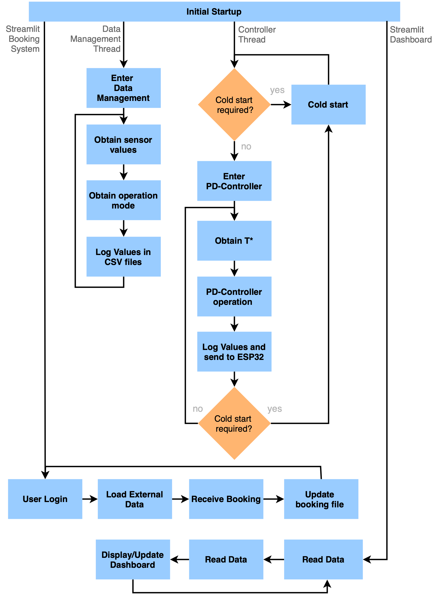

# Smart Steam Sauna

## Project Description

The repository presents a smart sauna operation. It includes:

- PD-Controller (Operates sauna)
- Data Management (Logs and distributes data)
- Booking Service (Manages bookings)
- Visualization Dashboard
- ESP32 Operations (Executes the commands and processes data as an edge device).

The Electrical Scheme on ESP32 side:

The Communication Scheme:

The Dataflow:

The Workflow:

## Requirements

To run this program, you will need the following:

- Python 3.10

- Arduino (C++)

- A list of dependencies can be found in the requirements.txt file

## Installation

To install the dependencies, run the following command:

Within Python virtual environment

`pip install -r requirements.txt
`

Global installments (For Streamlit servers):

`
pip install streamlit
`

`
pip install streamlit_authenticator
`

`
pip install plost 
`

## Usage

To run the python program (PD-Controller and Data Management), navigate to the directory where the program is located and run the following command:

`python main.py
`

To run the Streamlit applications, open two new terminals and navigate to the directory where the program is located and run the following command:

Booking Service:

`streamlit run Booking_System_app.py
`

Dashboard:

`streamlit run dashboard.py
`
## Authors

      Bendiks Herbold
      Gabriel Lesjak
      José Luz
      Marco Pascali

## License

This project is licensed under the MIT License